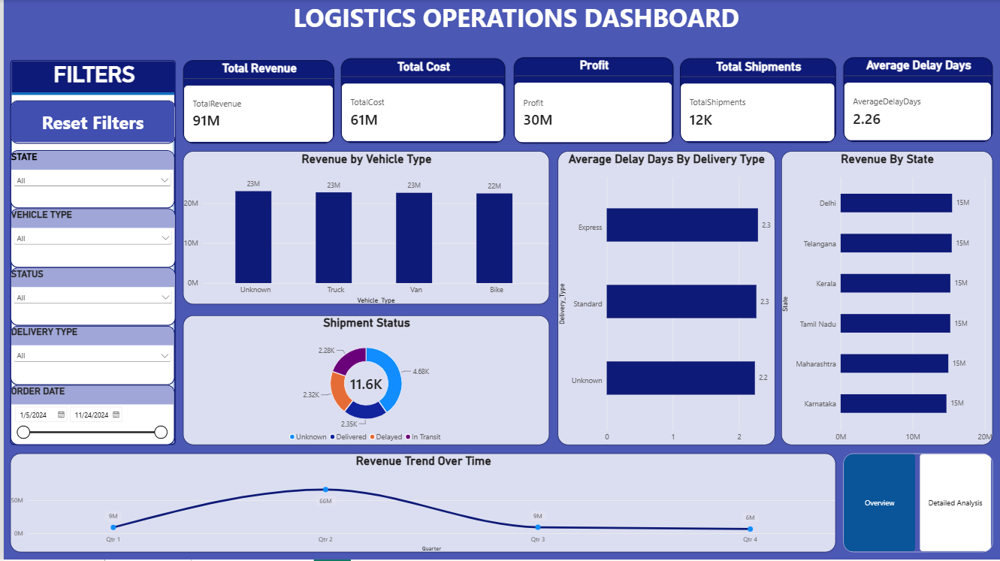
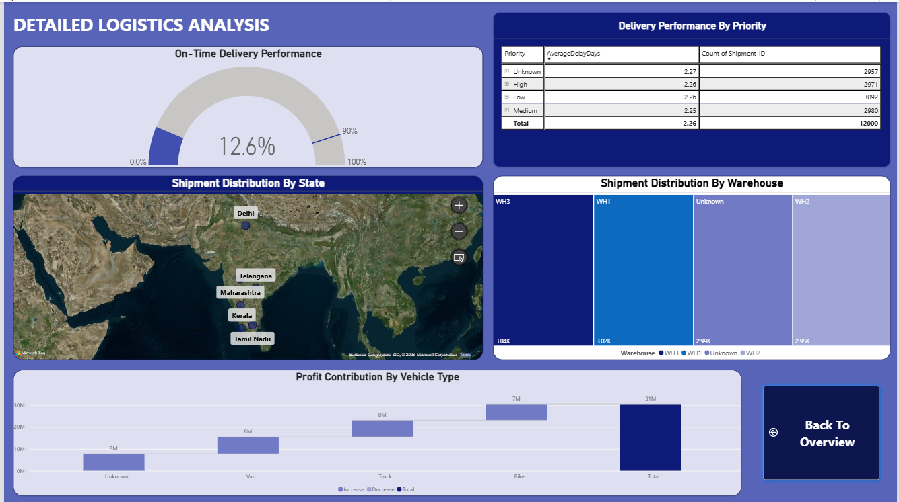

# Logistics Data Analysis - Power BI

## Project Overview
This project analyzes logistics operations using Microsoft Power BI. The report focuses on shipment performance, revenue, cost, profit, delivery delays, and operational performance across different states, vehicle types, warehouses, and delivery priorities.

The report contains an Overview dashboard and a Detailed Analysis page for exploring logistics performance from different perspectives.

## Key Performance Indicators
The dashboard tracks key logistics metrics including:

- Total Revenue
- Total Cost
- Profit
- Total Shipments
- Average Delay Days

## Dashboard Analysis

### 1. Revenue Analysis
- Analyzed revenue across different vehicle types.
- Compared revenue performance across states.
- Analyzed revenue trends over time.

### 2. Shipment Analysis
- Analyzed shipment status across different delivery stages.
- Examined shipment distribution across states.
- Compared shipment distribution across warehouses.

### 3. Delivery Performance
- Analyzed average delivery delays by delivery type.
- Evaluated on-time delivery performance.
- Compared delivery performance across different priority levels.

### 4. Profit Analysis
- Analyzed profit contribution across different vehicle types.

### 5. Interactive Filtering
The dashboard includes filters for:
- State
- Vehicle Type
- Shipment Status
- Delivery Type
- Order Date

## Report Pages

### Overview
Provides a summary of logistics operations using KPI cards, filters, revenue analysis, shipment status, delivery delays, state-level performance, and revenue trends.

### Detailed Analysis
Provides additional analysis of on-time delivery performance, delivery priority, shipment distribution by state and warehouse, and profit contribution by vehicle type.

## Tools Used
- Microsoft Power BI
- Power Query
- DAX

## Project File
The repository contains the Power BI report file.

'logistics data.pbix'
